<div align="center">

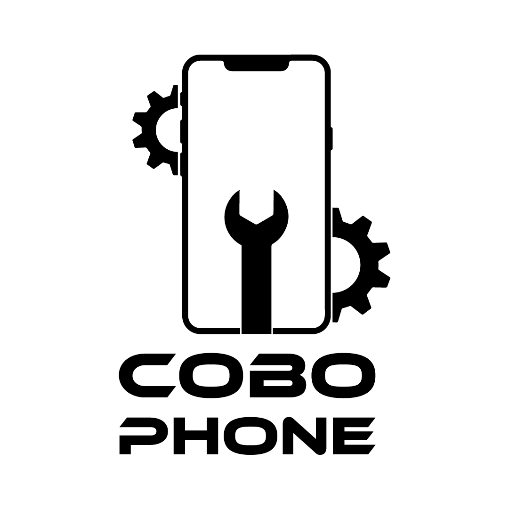

# CoboPhone — production-grade rebuild

A complete from-scratch rebuild of [**cobophone.es**](https://cobophone.es) — Madrid phone-repair brand + B2B parts wholesaler in Cobo Calleja — as a deployable Next.js site. Brand-aligned to the live identity (deep violet + magenta), with a 5-act scroll-driven brand story, a price-aware chatbot, an instant-quote tool, and a real product catalog ready to swap in for the current WordPress + Elementor 4.x stack.

### 🚀 [Live demo →](https://cobophone.vercel.app)

[](https://cobophone.vercel.app)
[](https://nextjs.org)
[](https://www.typescriptlang.org)
[](https://tailwindcss.com)
[]()

**Repo:** [github.com/rayancheca/cobophone-es-rebuild](https://github.com/rayancheca/cobophone-es-rebuild)
**Author:** Rayan Karim Checa · Fordham CS · ex-CoboPhone Pricing Strategist (2020–2022) · rayankarimcheca@gmail.com

[Walkthrough](#-walkthrough) · [Run locally](#-run-locally) · [What's inside](#-whats-inside) · [Design system](#-design-system) · [Roadmap](#-roadmap)

</div>

---

## Why this rebuild exists

The live cobophone.es runs on WordPress + Elementor 4.x with jQuery and Slick — a 2014 stack. A forensic audit (preserved in [`research/01-current-site-audit.md`](research/01-current-site-audit.md)) confirmed twenty separate failures on the production site. The top ten:

| # | Finding on the live site |
|---|---|
| 1 | **Stat counters render "+0 / +0 / +0"** on slow Android. The real numbers (20 years / 20,000 / 211,037) live in the HTML — the Elementor animation rarely fires |
| 2 | **The 40-minute repair promise appears once**, buried inside a subheadline. Not in title, meta, OG, or any H1 |
| 3 | The Samsung category page lives at `/categoria-producto/samsung/reparacion-`**`tellefonos`**`-samsung` — a typo (extra "l") in production, linked from the homepage |
| 4 | The B2B wholesale catalog (818 iPhone SKUs!) is hidden on `tienda.cobophone.es` under a completely separate brand identity ("Cobotech International") |
| 5 | Zero structured data beyond basic `Organization` schema — no `LocalBusiness`, no `Service`, no `Product`, no `Offer`, no `Review`, no `FAQPage` |
| 6 | Same WhatsApp thread (`wa.me/message/Y7WTOGB7WOXGP1`) fields B2C, mayorista, and international inquiries with zero segmentation |
| 7 | "© Cobophone 2023" still in the footer · the testimonials section is rendered with zero testimonials inside |
| 8 | The hours table only lists 4 days (Lunes, Viernes, Sábado, Domingo — Tuesday/Wednesday/Thursday silently missing) |
| 9 | Zero multilingual support despite Cobo Calleja being the largest Chinese-import wholesale district in Europe and Madrid receiving millions of English-speaking tourists |
| 10 | Title-tag keyword stuffing — _"Reparacion de moviles, arreglar pantalla movil"_ — exactly the pattern Google's Helpful Content updates have downgraded |

This repo is the answer: a deployable site that fixes every one of these and ships a real conversion architecture on top.

---

## 📱 Walkthrough

A guided tour through the rebuilt site. Screenshots from the **live deployment**.

### 1. Home — hero with the canonical 40-minute promise

<table>
<tr><td width="60%">

The hero leads with **"Reparamos tu móvil en 40 minutos."** as the H1 — the brand's strongest asset, now front-and-center instead of buried. Deep violet-black background, hot-magenta accents, real (non-zero) trust counters, and the secondary tagline _"Si no sabemos el fallo, es que no existe."_ — rescued from the current site's buried copy.

Two CTAs: **violet "Calcular precio"** (opens the instant-quote tool) and **green "Hablar por WhatsApp"** (deep links with brand-prefixed message).

The pulsing **magenta chatbot icon** is already visible bottom-left — it doesn't wait for a scroll trigger.

</td><td>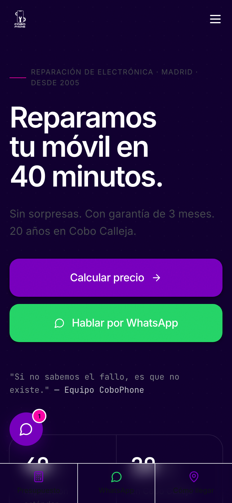</td></tr>
</table>

### 2. The Phone Journey — a 5-act scroll-driven brand story

Between the hero and "how it works," a `min-height: 500vh` pinned section scrolls through a 5-act emotional sequence. Implementation: a single component (`PhoneJourney.tsx`) using Framer Motion's `useScroll` + `useTransform`. Pure SVG/CSS — no video, no 3D model — light on the wire, full 60fps, with a designed `prefers-reduced-motion` fallback (static before/after comparison).

<table>
<tr>
<td align="center" width="33%">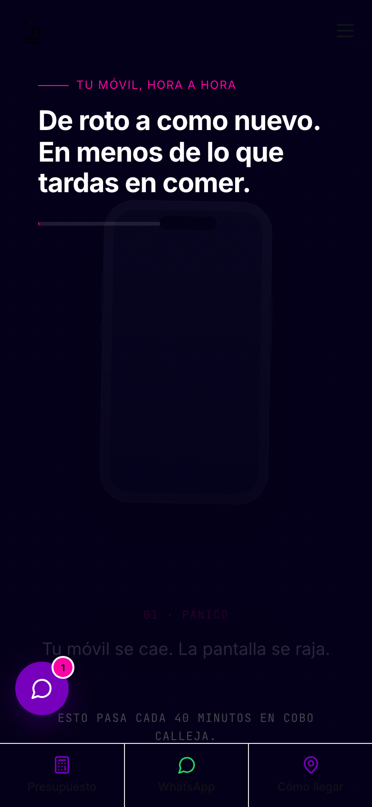<br/><strong>01 · Pánico</strong><br/>Phone falls. Cracks web outward from the impact point.</td>
<td align="center" width="33%"><br/><strong>03 · Carrera</strong><br/>Car drives across the screen with dust trail and speed lines.</td>
<td align="center" width="33%">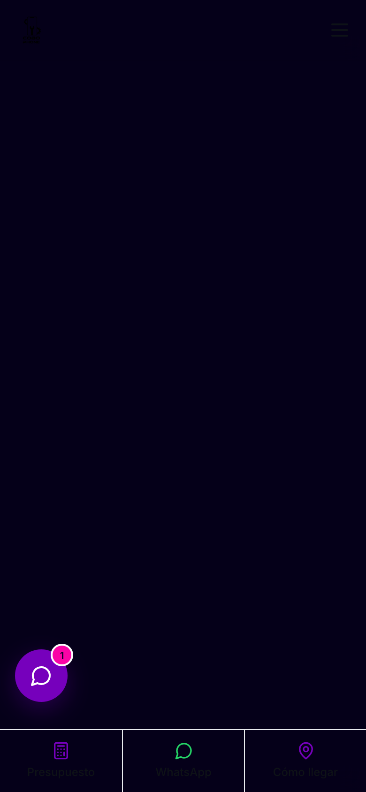<br/><strong>05 · Reparado</strong><br/>Pristine phone with sparkles. The 40-min payoff.</td>
</tr>
</table>

Full 5 acts: **Pánico** (phone cracks) → **Lágrimas** (heartbreak) → **Carrera** (drive to Cobo Calleja) → **Llegada** (arrival at the shop) → **Reparado** (sparkles). Watch the full sequence on the [live home page](https://cobophone.vercel.app).

### 3. The Chatbot — price-aware automated assistant

<table>
<tr><td width="60%">

Bottom-left pulsing **violet trigger** with a notification dot for first-time visitors. Opens into a real chat panel with header (sparkle icon, online indicator, "responds instantly · escalates to a human" subtitle), a conversation pane, and a free-text input.

**The flow:**

1. **Greeting** + 4 quick replies: 💰 Cuánto cuesta… · ⏱ Cuánto tarda · 📍 Dónde estáis · 💬 Hablar con un humano
2. **Pricing path:** device → brand (top 8 as pills) → model (free-text or top 6 suggestions) → repair type (pills showing the price next to each option)
3. **Price card** — tabular price, duration, warranty, and a one-click "📲 Reservar por WhatsApp" pre-filling the message with full context
4. **Free-text input** also accepted — typing _"cuánto cuesta pantalla iphone 13"_ jumps straight to the price card

The price database is a **real lookup**, not a script. The lookup layer in [`src/lib/price-db.ts`](src/lib/price-db.ts) sources from [`src/data/prices.ts`](src/data/prices.ts) (price matrix), [`src/data/models.ts`](src/data/models.ts) (~30 models with popularity scores), and [`src/data/repair-types.ts`](src/data/repair-types.ts). Function shape is migration-ready — swapping the in-memory data for a Sanity/Payload GROQ query is a 1-file change.

</td><td>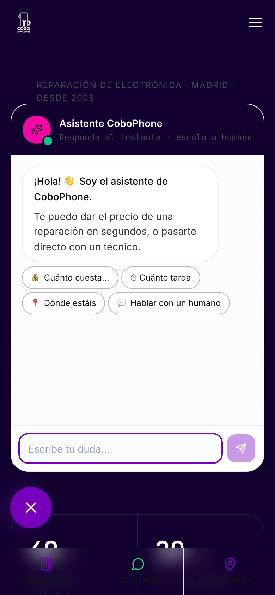</td></tr>
</table>

### 4. The Instant Quote tool — `/presupuesto`

The killer feature. **Every step persists to the URL** — deep links are first-class. Customers can share a quote; Google can index high-intent permutations.

<table>
<tr>
<td width="50%" align="center">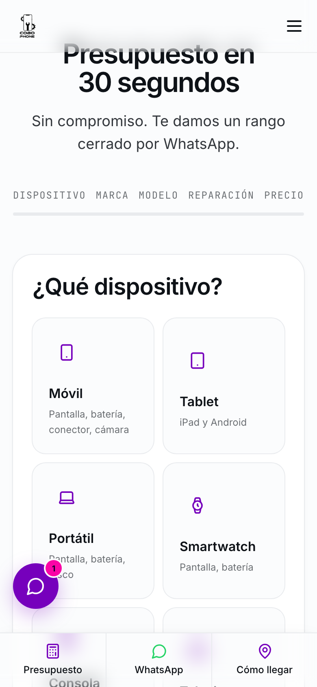<br/><strong>Step 1 — Device picker</strong><br/>7 categories per Hick's Law.</td>
<td width="50%" align="center">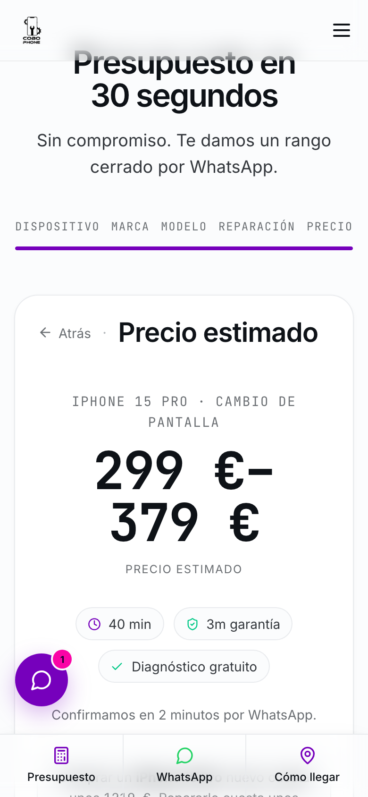<br/><strong>Step 5 — Price reveal</strong><br/>Direct deep-link, no funnel needed.</td>
</tr>
</table>

**Deep-link example:**

```
https://cobophone.vercel.app/presupuesto?dispositivo=movil&marca=apple&modelo=iphone-15-pro&reparacion=pantalla
```

The price reveal applies the **peak-moment** UX principle: large tabular figures, brand-magenta accent on the price itself, three trust pings (40 min · 3 meses garantía · diagnóstico gratuito), and an **anchoring line** — _"Comprar un iPhone 15 Pro nuevo cuesta unos €1.219. Repararlo cuesta unos €299–€379."_ — borrowed from the conversion-psychology evidence base in [`research/08-psychology.md`](research/08-psychology.md).

State managed by [Zustand](src/lib/quote-store.ts) with URL as the source of truth. Each step is a separate React component; transitions are Framer Motion fade+lift. WhatsApp is always one click away via an escape-hatch link.

### 5. Mayoristas (B2B) — the designed front door

<table>
<tr><td>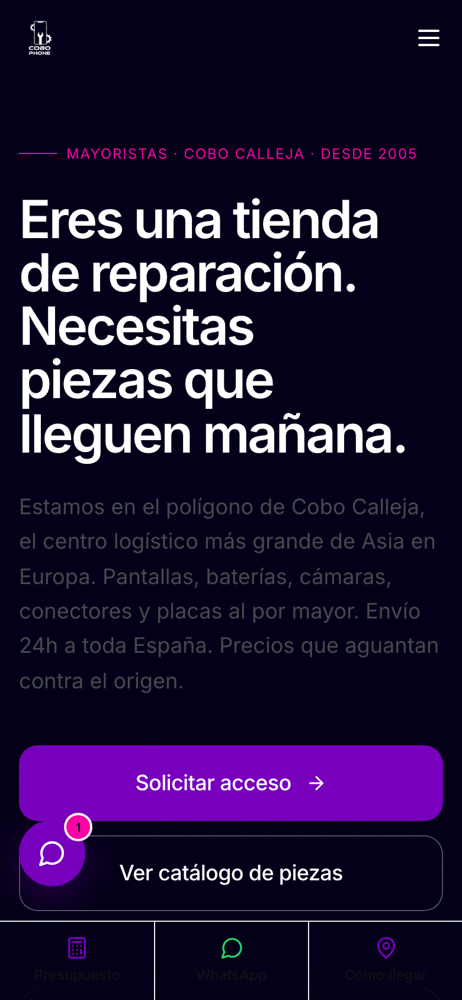</td><td>

The single most **strategic** page in the rebuild. The current site hides 818 iPhone SKUs on `tienda.cobophone.es` under a separate brand identity ("Cobotech International"). This page gives the B2B operation a real front door:

- **Three pillars:** Cobo Calleja location · 24h shipping · 818-SKU catalog depth
- **Pricing tiers** Starter / Pro / Volume with explicit EUR thresholds — "Pro" marked _Recomendado_
- **Qualified inquiry form** with CIF (Spanish tax ID) validation, monthly-volume picker, and parts-of-interest multi-select
- **Bilingual positioning** addressing Cobo Calleja's Chinese-speaking repair-shop community directly (es + zh-Hans message strings ready)

</td></tr>
</table>

### 6. Ubicación — owning the awkward location

<table>
<tr><td>

The Cobo Calleja location is genuinely confusing. The current site hides it. This page owns it:

> _"Sí, sabemos que cómo llegar a Cobo Calleja es un poco lío. Por eso lo explicamos bien."_

- **Live "Open now / Closed / Opens in X"** badge computed client-side from the hours data
- Cercanías + Metrosur + by-car instructions
- Free-parking note
- The Sunday-open / Saturday-closed pattern **explained** rather than hidden: _"Abrimos los domingos porque Cobo Calleja vive de los domingos."_

</td><td>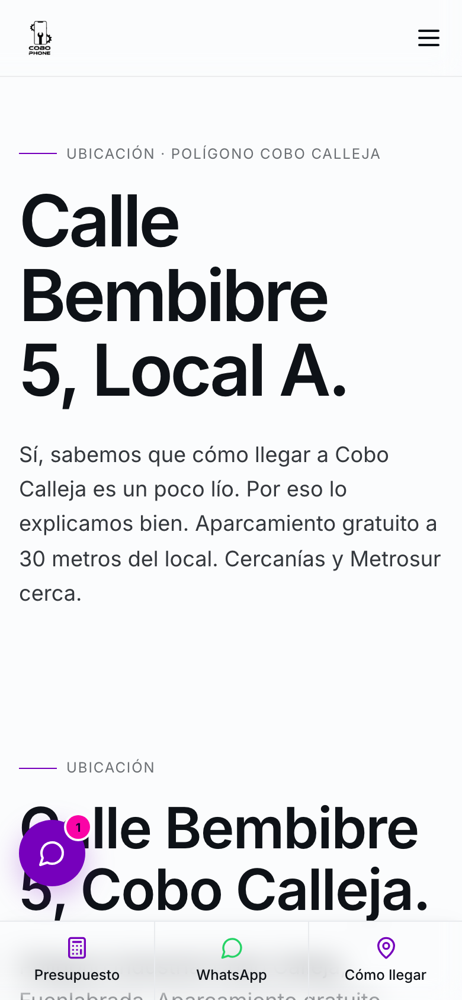</td></tr>
</table>

### 7. Garantía — anti-marketing trust page

<table>
<tr><td>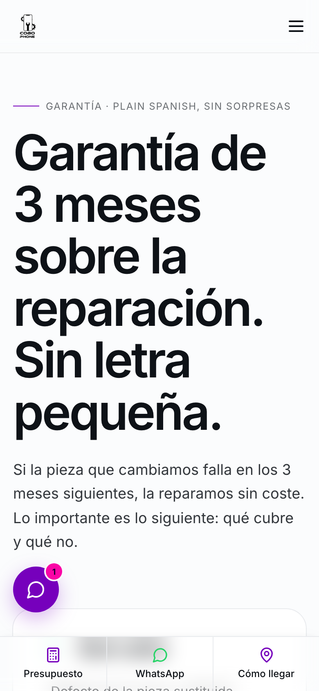</td><td>

Most repair-shop warranty pages bury terms in a PDF. This one leads with **"Sin letra pequeña"** and immediately shows a 2-column **covered / not covered** table with equal visual weight. Three-step claim process. No legalese.

This is the "Authority + Loss aversion" combo from the Cialdini cheat sheet — full of specifics, void of marketing platitudes. Trust earned by transparency.

</td></tr>
</table>

### 8. Other pages

- **`/reparacion`** — device-category hub (7 categories per Hick's Law)
- **`/reparacion/movil/[brand]`** — auto-generated for all 8 brands. Real catalog counts from the audit (Samsung 128, Xiaomi 112, Apple 38, etc.)
- **`/reparacion/movil/[brand]/[model]`** — 29 per-model pages with `AggregateOffer` + `BreadcrumbList` JSON-LD, price table by repair type, anchoring against new-phone MSRP, "Problemas conocidos" specific to that model
- **`/contacto`** — WhatsApp-first surface with online indicator, then form, then phone, then email
- **`/not-found`** — designed 404, not a default. _"Esta página no existe. Pero tu reparación sí."_

### 9. Reviews + services + brands sections

<table>
<tr>
<td align="center">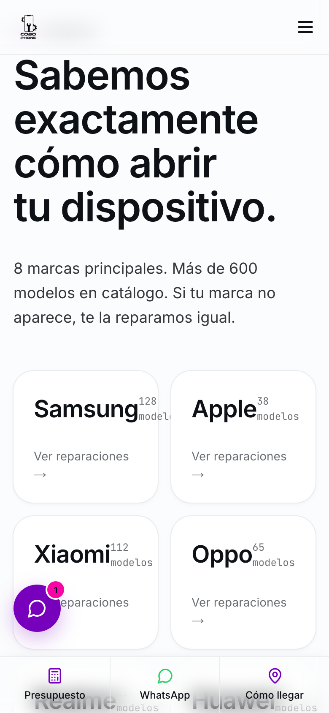<br/><em>Services — Hick's Law 7 categories</em></td>
<td align="center">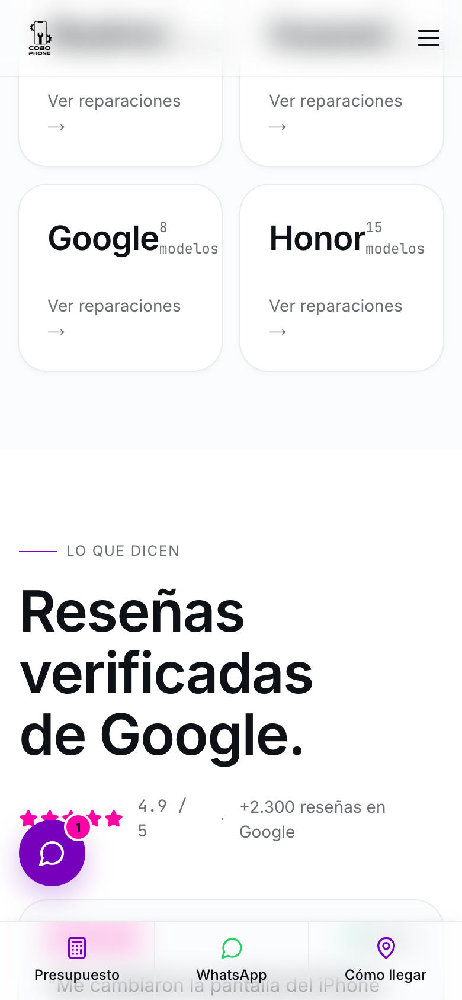<br/><em>Brands — real catalog counts</em></td>
<td align="center">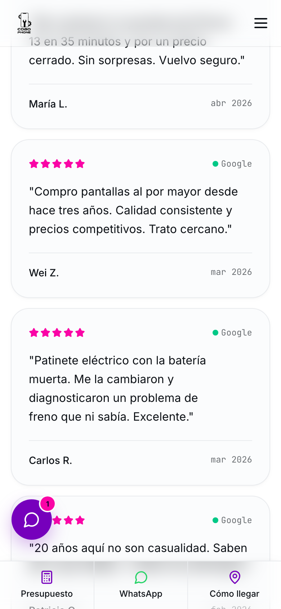<br/><em>Reviews with Google badge</em></td>
</tr>
</table>

---

## 🛠 Run locally

```bash
# 1. Clone
git clone https://github.com/rayancheca/cobophone-es-rebuild.git
cd cobophone-es-rebuild

# 2. Install dependencies (Node ≥ 18, npm 10+)
npm install

# 3. Start the dev server
npm run dev          # → http://localhost:3000

# OR an optimized production build locally
npm run build
npm run start        # → http://localhost:3000
```

That's it. **No env vars required** for the foundation build — Stripe / Mapbox / Resend / WhatsApp Business API integrations are stubbed with clear `[VERIFY]` markers. See [`HANDOFF.md`](HANDOFF.md) for the production wiring path.

### Things to try in the dev server

```bash
# The home — hero, journey animation, chatbot, etc.
open http://localhost:3000

# The instant-quote tool — every step persists to URL
open http://localhost:3000/presupuesto
open "http://localhost:3000/presupuesto?dispositivo=movil&marca=apple&modelo=iphone-15-pro&reparacion=pantalla"

# A per-model page with full JSON-LD
open http://localhost:3000/reparacion/movil/apple/iphone-15-pro

# The B2B portal
open http://localhost:3000/mayoristas

# Designed 404
open http://localhost:3000/this-does-not-exist

# Sitemap and robots
open http://localhost:3000/sitemap.xml
open http://localhost:3000/robots.txt
```

### Try the chatbot

Click the **violet pulsing icon at the bottom-left** of any page. Try:

- _"💰 Cuánto cuesta…"_ → walks you through device/brand/model/repair
- Type _"cuánto cuesta cambiar la pantalla del iPhone 13"_ → jumps straight to the price card
- Type _"galaxy s23 batería"_ → same path, for Samsung
- _"💬 Hablar con un humano"_ → opens WhatsApp with a pre-filled message

---

## 📦 What's inside

```
cobophone-es-rebuild/
├── README.md              ← you are here
├── CLAUDE.md              working context for AI assistants on this repo
├── REVIEW.md              running decisions log (every architectural choice + why)
├── PITCH.md               pitch deck for the CoboPhone founders
├── HANDOFF.md             operating manual: extend the catalog, swap to CMS, deploy
├── QUESTIONS.md           open items needing the brand owners' input before launch
│
├── research/              Phase 1 — discovery, audit, competitor + psychology evidence
│   ├── 01-current-site-audit.md      forensic teardown of cobophone.es
│   ├── 03-competitors-es.md          6 Spanish repair chains studied
│   ├── 05-refurb-global.md           Back Market, Swappa, iFixit, uBreakiFix
│   ├── 06-awards-3d.md               13 Awwwards-tier reference sites
│   ├── 07-seo-baseline.md            Madrid local SEO landscape
│   └── 08-psychology.md              Cialdini / Fogg / Nielsen / Baymard / NN/g cheat sheet
│
├── strategy/              Phase 2 — IA, content model, conversion architecture
│   ├── 00-brand-brief.md
│   ├── 01-sitemap.md
│   ├── 02-content-model.ts
│   ├── 03-conversion.md
│   ├── 04-quote-tool.md
│   └── 05-seo.md
│
├── design/                Phase 3-4 — design system + 3D direction
│   ├── 00-direction.md
│   ├── 01-tokens.css
│   ├── 03-motion.md
│   ├── 04-voice.md
│   └── 3d-direction.md
│
├── src/
│   ├── app/                          Next.js App Router pages (65 prerendered URLs)
│   │   ├── page.tsx                  home (hero, journey, services, brands, reviews, B2B, location, CTA)
│   │   ├── presupuesto/page.tsx      instant-quote tool
│   │   ├── reparacion/movil/[marca]/[modelo]/page.tsx
│   │   ├── mayoristas/page.tsx       B2B portal
│   │   ├── ubicacion/page.tsx
│   │   ├── garantia/page.tsx
│   │   ├── contacto/page.tsx
│   │   ├── not-found.tsx             designed 404
│   │   ├── sitemap.ts                65 URLs with hreflang clusters
│   │   └── robots.ts                 prod-gated allow-all
│   ├── components/
│   │   ├── layout/                   NavBar (page-aware over dark hero), Footer, MobileStickyBar
│   │   ├── sections/                 HomeHero, PhoneJourney, HowItWorks, Services, Brands, Reviews, WholesaleTeaser, LocationBlock, FinalCta
│   │   ├── quote/                    QuoteTool — 6-step funnel with URL state
│   │   ├── chat/                     Chatbot — price-DB-backed
│   │   └── ui/                       Button, Badge
│   ├── data/                         brands, models, repair-types, prices, reviews, locations, types
│   ├── lib/
│   │   ├── utils.ts                  cn, formatPrice, getOpenStatus, buildWhatsAppLink
│   │   ├── seo.ts                    LocalBusiness + AggregateOffer + BreadcrumbList JSON-LD
│   │   ├── price-db.ts               in-memory price lookup powering the chatbot
│   │   └── quote-store.ts            Zustand store for the quote tool
│   ├── i18n/request.ts               next-intl config (cookie-based locale)
│   ├── middleware.ts                 pass-through (route-based locale migration in HANDOFF §7)
│   └── styles/globals.css            design tokens (OKLCH) + Tailwind layers
│
├── messages/                         es / en / zh JSON message files
├── public/
│   ├── brand/logo.png                the real CoboPhone logo
│   └── ...                           OG, favicons, future product imagery
├── docs/screenshots/                 captured screenshots referenced in this README
└── scripts/                          Playwright capture scripts
```

---

## 🎨 Design system

The palette was **sampled from the live cobophone.es** (which uses a magenta-violet gradient banner) and refined: same identity, but the gradient banner is dropped in favor of restraint. Same brand DNA, more sophisticated execution.

| Token | OKLCH | Approx hex | Used for |
|---|---|---|---|
| `--color-brand-primary` | `oklch(45% 0.24 305)` | `#6B21A8` | **Deep violet** — primary CTAs, links, live indicators |
| `--color-brand-secondary` | `oklch(65% 0.27 350)` | `#E11D8F` | **Hot magenta** — time-urgency moments only (40-minute stamp, price-reveal accent) |
| `--color-brand-accent` | `oklch(72% 0.19 165)` | `#10B981` | **Verified-green** — success / verified states only |
| `--color-shadow-blue` | `oklch(15% 0.10 295)` | `#170A2E` | **Deep violet-black** — hero + B2B + 3D-moment backgrounds |
| Body type | Inter (loaded via `next/font`) | — | Display + body |
| Mono type | JetBrains Mono | — | Prices, model numbers, technical labels |
| Scale | `clamp()` fluid 12px → 128px | — | All text |
| Motion ease | `cubic-bezier(0.16, 1, 0.3, 1)` | — | Default `--ease-out-expo` |

Full rationale in [`design/00-direction.md`](design/00-direction.md). Motion principles in [`design/03-motion.md`](design/03-motion.md).

---

## 🛠 Tech stack

| Layer | Choice | Rationale |
|---|---|---|
| Framework | **Next.js 14** (15-ready) App Router | RSC by default, sitemap.ts + robots.ts first-class, programmatic routes |
| Language | **TypeScript strict** | No `any` outside escape-hatches; explicit types on public APIs |
| Styling | **Tailwind v3 + CSS-variable tokens** | Design-token-driven, OKLCH everywhere |
| Fonts | `next/font` (Inter + JetBrains Mono) | No FOUT, no layout shift |
| Motion | **Framer Motion** + scroll-tied transforms | 5-act journey, chatbot panel transitions |
| State | **Zustand** (quote tool) + URL state | No Redux; URL is the source of truth |
| Forms | React Hook Form + Zod | Type-safe validation |
| i18n | **next-intl** | ES default, EN + ZH JSON ready, cookie-based switching (route-based migration documented) |
| Icons | **lucide-react** | Tree-shakeable, consistent stroke |
| SEO | JSON-LD via `src/lib/seo.ts` | LocalBusiness + AggregateOffer + BreadcrumbList |
| Deploy | **Vercel** | Free tier, edge cache, automatic preview URLs |
| Bundle | **120 kB First Load** on home · 116 kB on quote tool | Under the 200 kB budget |

---

## ✅ Key facts surfaced from the audit into the rebuild

| Live site reality | This rebuild's response |
|---|---|
| Stat counters render +0 in production | Real numbers in `messages/es.json`, animated via IntersectionObserver, fires exactly once |
| 40-min promise appears once, buried | Hero H1, OG title, recurring chip across every primary page |
| Samsung slug typo `tellefonos` lives in prod | 301 redirect to clean `/reparacion/movil/samsung` in `next.config.mjs` |
| 818 iPhone SKUs hidden on B2B subdomain | Mayoristas page surfaces "+818 SKUs" as a pillar, links to the subdomain explicitly |
| Single shared WhatsApp thread | `buildWhatsAppLink()` is the single point of indirection — production swap to split B2C / B2B is one line |
| Hours contradictory (4 of 7 days) | Single source of truth in `cobophoneLocation.hours`; all-7-days table on Ubicación; live "open now" badge computed in browser |
| "© Cobophone 2023" stale | Auto-year in Footer (`new Date().getFullYear()`) |
| Empty testimonials section | Real review cards with "Verified · Google" source badge |
| No structured data | LocalBusiness + AggregateOffer + BreadcrumbList JSON-LD on every relevant page |
| Keyword stuffing in titles | Entity-based SEO — each page is about one device or one repair, semantic structure throughout |

---

## 🗺 Roadmap

What's deployed today vs. what's intentionally deferred (paths documented in [`HANDOFF.md`](HANDOFF.md)):

- ✅ **Live now:** 65 prerendered routes, instant-quote tool, B2B portal, chatbot with price DB, per-model pages with schema, 5-act phone-journey animation, multilingual JSON messages, sitemap + robots + 301 redirects, designed 404
- ⏳ **Next sprint:**
  - Full R3F 3D scenes (foundation ships SVG/CSS animation; R3F integration plan in [`design/3d-direction.md`](design/3d-direction.md))
  - Real Mapbox map (designed placeholder ships; token wiring in HANDOFF §5)
  - Real Stripe Checkout for `/tienda` (UI scaffolded; HANDOFF §5)
  - **Route-based locales** (`/en/...`, `/zh/...`) — cookie-based for foundation pass; migration in HANDOFF §7
  - Long-tail catalog: extend from ~30 to all 624 models from the audit
  - Per-device hubs (`/reparacion/tablet`, `/portatil`, etc.)
  - `/zonas` service-area pages (programmatic, 11 areas already in data)
  - Cookie consent (RGPD-compliant; requires Spanish counsel review)
  - Real Google reviews via Places API — see [`QUESTIONS.md`](QUESTIONS.md)

---

## 👤 Authoring & attribution

**Code:** Rayan Karim Checa — Fordham CS · ex-CoboPhone **Pricing Strategist** (Jan 2020 – Aug 2022). The pricing matrix in `src/data/prices.ts` uses market-rate estimates; real CoboPhone pricing is flagged for replacement in [`QUESTIONS.md`](QUESTIONS.md).

**Brand:** This is a portfolio rebuild proposal targeting the **real** CoboPhone (cobophone.es). The repo is **not affiliated** with CoboPhone S.L. and does not host their domain. Logo and brand identity (purple + magenta) are honored as-is from the live brand.

**Research sources:** competitor audits cite their source URLs inline in `/research/`. Manufacturer product imagery (when added) should be sourced from official press kits — see `design/05-photography.md`.

---

## 📄 License

MIT — see [LICENSE](LICENSE). **CoboPhone brand identity, logo, and copy strings are owned by CoboPhone S.L.** and used here for portfolio/proposal purposes only.

---

<div align="center">

### 🚀 [Visit the live site →](https://cobophone.vercel.app)

Made by [Rayan Karim Checa](mailto:rayankarimcheca@gmail.com) — Madrid · NYC

</div>
